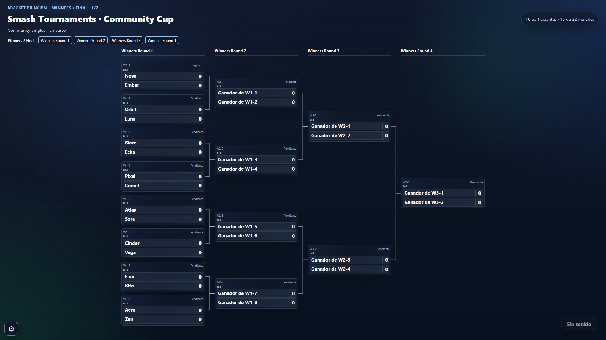
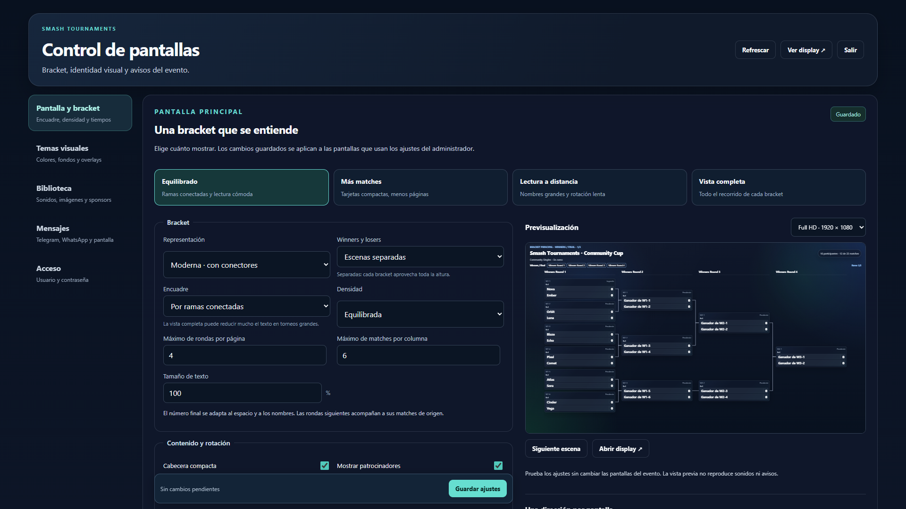
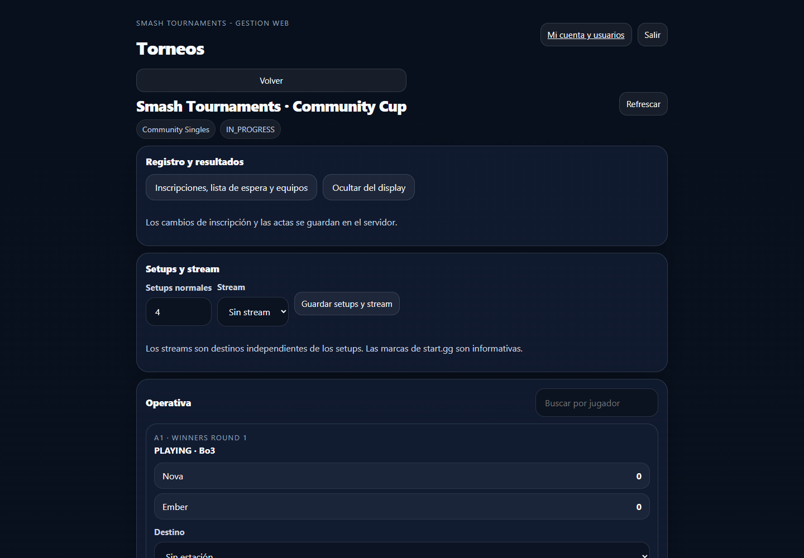
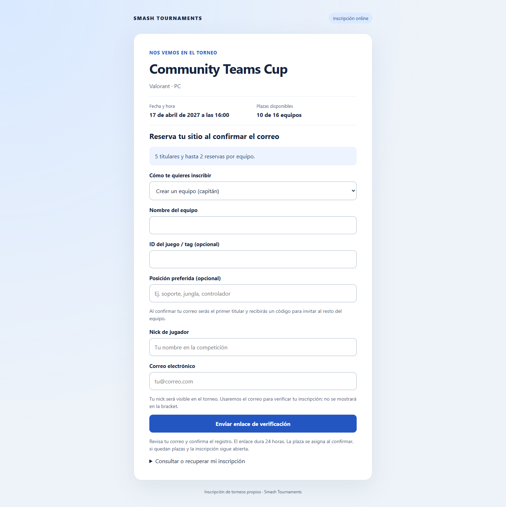
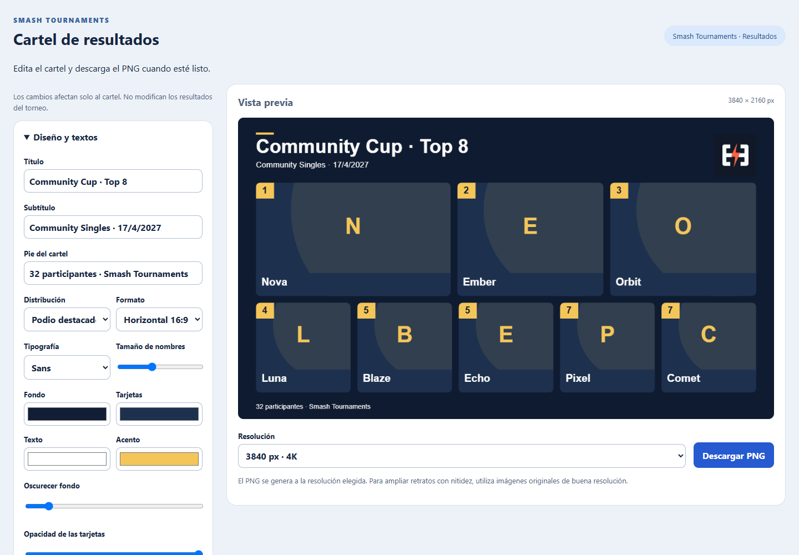
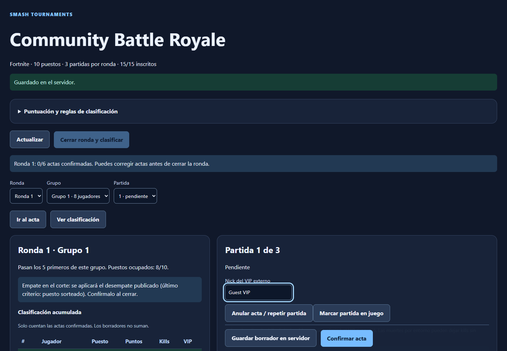

# Example screens

These PNGs show the real web interfaces running locally with synthetic tournament data. Names, scores, registration capacity and dates are examples. They are not screenshots of a live event. The current interfaces are primarily in Spanish.

## Tournament display



The shared display rotates tournament scenes and can separate Winners and Losers for readability. Configure density, text scale and layout for the physical screen.

## Display administration



Preview layout changes before saving, manage event themes, artwork, sponsors and announcement templates.

## Web management



Staff use the same accounts as the native management apps and display administration. Players continue to use start.gg sign-in.

## Public team registration



Players can create a team, join by invitation or register alone when the organizer allows it. A registration is confirmed through email.

## Results poster



This example uses custom artwork mode and the generic logo. The editor also offers shared character collections, backgrounds, positioning and high-resolution PNG export.

## Battle royale administration



Groups contain numbered participant seats. The separate guest VIP, placements and eliminations contribute to the accumulated score.

## Reproduce the examples

From the repository root with Node 22+:

```bash
npm ci
npx playwright install chromium
npm run screenshots
```

The script starts a temporary loopback server and an in-memory PostgreSQL-compatible test database. It does not read `.env`, contact a production server, send email or use real player accounts. Set `CHROME_PATH` if you prefer an installed compatible Chromium browser. It writes only `docs/en/images/` and temporary fixture data.

Return to the [README](../../README.md) or [User guide](USER_GUIDE.md).
